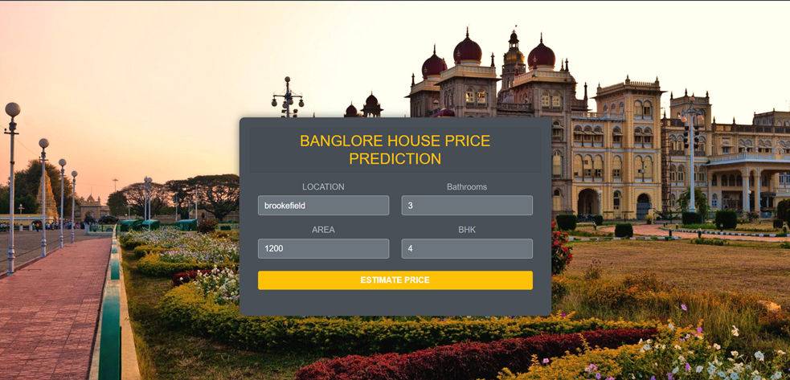

# 🏠 Real Estate Price Prediction in Bengaluru

This project allows users to **predict the price of a house in Bengaluru** based on key features such as location, area (in square feet), number of bathrooms, and BHK configuration. It's a simple yet powerful web-based machine learning application aimed at helping users make informed real estate decisions.

---

## User Input Sample: 

## Output Sample:

---

## 🚀 Features

- Predict house prices in different localities of Bengaluru.
- Clean and interactive UI to input:
  - **Location**
  - **Total Area (sq.ft.)**
  - **Number of Bathrooms**
  - **BHK (Bedrooms, Hall, Kitchen)**
- Backend powered by a machine learning model trained on real housing data.

---

## 🧠 Tech Stack

- **Frontend:** HTML, CSS, JavaScript
- **Backend:** Python, Flask
- **Machine Learning:** Scikit-Learn, Pandas, NumPy
- **Model:** Linear Regression with feature engineering
- **Deployment Ready:** REST API built using Flask

---

## 📂 Folder Structure

├── client               # Frontend files (HTML, CSS, JS)
├── server               # Backend Flask app
│   ├── artifacts        # Saved model and columns
│   ├── model            # Model training scripts
│   ├── util.py          # Utilities for prediction
│   └── server.py        # Flask app entry point
├── banglore_home_prices.csv  # Dataset used for training
├── README.md
└── requirements.txt     # Python dependencies

---

## ⚙️ How to Run Locally

1. Clone the Repository:
   git clone https://github.com/AtharvaKhismatrao/Real-Estate-Price-Prediction-in-Bengluru.git
   cd Real-Estate-Price-Prediction-in-Bengluru
   
2. Create Virtual Environment (Optional but Recommended):
   python -m venv venv
   source venv/bin/activate  # On Windows: venv\Scripts\activate

3. Install Dependencies:
   pip install -r requirements.txt

4. Run the Flask Server:
   cd server
   python server.py

The app will be running at http://127.0.0.1:5000/

---

## 🧪 Model Training (Optional)

If you'd like to retrain the model:
  cd server/model
  python model_training.py
This script processes the dataset and retrains the regression model with updated data.

---

## 🔮 Sample Prediction

Location: Brookefield
Area: 1200 sq.ft.
BHK: 4
Bathrooms: 3
✅ Estimated Price: 83.24 Lakhs

---

## 📈 Future Improvements

- Add location auto-complete using Google Maps API.
- Add more advanced ML models (Random Forest, XGBoost, etc.)
- Deployment on cloud platform like Heroku or AWS.
- Add historical pricing trends for visual analysis...

---

## 📄 License

This project is licensed under the MIT License.
Developed with ❤️ by Atharva Khismatrao.

---

## 🙌 Acknowledgements

- Kaggle for providing the dataset

---

